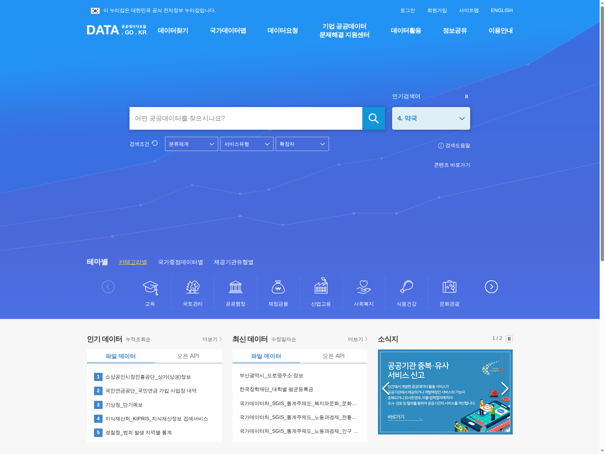
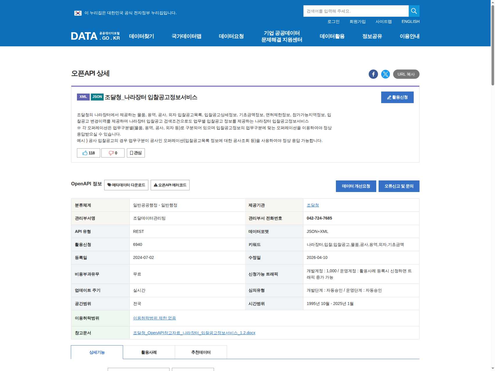
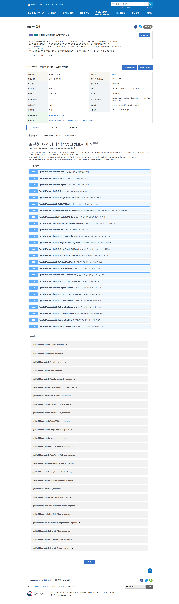

# 공공데이터포털 이용 가이드

나라장터(KONEPS) MCP 를 쓰려면 `data.go.kr` 공공데이터포털에서 **무료 인증키** 를 발급받아야 합니다. 이 문서는 신규 사용자가 처음부터 끝까지 따라갈 수 있도록 단계별로 안내합니다.

> ⏱️ 예상 소요 시간: 회원가입 3분 + 활용신청 1분 + 자동 승인 즉시 (운영계정도 자동승인)

---

## 0. 한눈에 보기

```
① 공공데이터포털 회원가입
        ↓
② 조달청_나라장터 입찰공고정보서비스 페이지 접속
        ↓
③ [활용신청] 버튼 클릭 → 사유 작성 → 제출
        ↓
④ 자동승인 (즉시) → 마이페이지에서 인증키 확인
        ↓
⑤ "일반 인증키 (Decoding)" 복사 → 프로젝트 .env 에 붙여넣기
```

---

## 1. 회원가입

### 1-1. 공공데이터포털 접속
브라우저에서 <https://www.data.go.kr/> 접속.



우측 상단의 **회원가입** 링크 클릭.

- **개인 회원**: 주민등록번호 또는 휴대폰 본인인증
- **기업 회원**: 사업자등록번호 (선택)

> 💡 본 프로젝트 용도라면 개인 회원으로 충분합니다.

### 1-2. 가입 완료 후 로그인
이메일 인증을 마치면 즉시 로그인 가능.

---

## 2. API 활용신청

### 2-1. API 상세 페이지 접속
아래 2개 API 를 각각 신청해야 합니다. 링크를 새 탭으로 여세요.

| # | API 이름 | URL |
|---|---|---|
| A | 조달청_나라장터 **입찰공고정보서비스** | <https://www.data.go.kr/data/15129394/openapi.do> |
| B | (선택) 조달청_나라장터 **사전규격서비스** | 포털에서 "나라장터 사전규격" 검색 |

위 A 페이지는 아래 화면처럼 보입니다.



### 2-2. 메타 정보 확인
스크롤을 조금 내리면 아래와 같은 핵심 정보가 있습니다.



확인 포인트:

| 항목 | 기대값 | 의미 |
|---|---|---|
| 비용부과유무 | **무료** | 돈 안 듦 |
| 심의유형 | **자동승인** | 바로 쓸 수 있음 |
| 신청가능 트래픽 | 개발계정 **1,000/일** | 초기에 충분 |
| 데이터포맷 | JSON+XML | 본 MCP 는 JSON 사용 |
| API 유형 | REST | 우리가 이미 연동 완료 |

### 2-3. [활용신청] 버튼 클릭
페이지 우상단에 파란색 **활용신청** 버튼이 있습니다.


클릭하면 신청서 페이지로 이동합니다.

### 2-4. 신청서 작성
| 필드 | 입력 예시 |
|---|---|
| 활용목적 | `개인 학습 / 조달 데이터 분석 MCP 도구 개발` |
| 시스템 유형 | **일반** (웹/앱 없이 API만 호출) |
| 이용허락범위 | ☑ 동의 |

> 💡 활용목적은 심사 대상이 아닙니다. 자동승인이므로 형식만 갖추면 됩니다.

**신청** 클릭.

### 2-5. 자동승인 확인
신청 즉시 상태가 **승인**으로 바뀝니다. (간혹 1~2시간 지연 있음)

---

## 3. 인증키 복사

### 3-1. 마이페이지 이동
상단 메뉴 **마이페이지** → **오픈API** → **개발계정** 탭.

### 3-2. 신청한 서비스 클릭
방금 신청한 "조달청_나라장터 입찰공고정보서비스" 항목을 클릭하면 상세가 열립니다.

### 3-3. 인증키 섹션 확인
아래 두 가지 키가 표시됩니다.

| 구분 | 형태 예시 | 이 프로젝트에서 사용? |
|---|---|---|
| **일반 인증키 (Encoding)** | `abc%2Fdef%2B...` | ❌ **쓰지 말 것** |
| **일반 인증키 (Decoding)** | `abc/def+...` | ✅ **이것을 복사** |

> ⚠️ **Encoding 키를 쓰면 401 에러가 납니다.** MCP 서버가 내부적으로 URL 인코딩을 또 하기 때문입니다(이중 인코딩). 반드시 **Decoding** 키를 사용하세요.

### 3-4. 프로젝트 `.env` 에 붙여넣기
프로젝트 루트 터미널에서:

```bash
cp .env.example .env
```

편집기로 `.env` 열어서:

```bash
NARA_API_KEY=여기에_Decoding_키_원본_붙여넣기
NARA_PRESPEC_API_KEY=여기에_Decoding_키_원본_붙여넣기
```

저장 후 권한 제한:
```bash
chmod 600 .env
```

---

## 4. 연결 테스트

Claude Code 사용자:
```bash
claude  # 프로젝트 루트에서 실행 → MCP 승인 프롬프트 수락
# 대화창에서: 나라장터에서 "AI" 키워드로 최근 7일 입찰공고 검색해줘
```

Claude Desktop 사용자:
```bash
bash scripts/setup-claude-desktop.sh
# Claude Desktop 완전 종료 후 재시작
# 대화창에서: 나라장터에서 "AI" 키워드로 최근 7일 입찰공고 검색해줘
```

입찰공고 목록이 돌아오면 **성공**.

---

## 5. 자주 발생하는 문제

### 5-1. 401 Unauthorized / SERVICE_KEY_IS_NOT_REGISTERED_ERROR
**원인**: 활용신청 승인이 아직 전파 중 (드물게 1~2시간).

**조치**: 포털에서 해당 API 상태가 "승인"인지 확인 후 대기. 즉시 쓰려면 다른 승인된 API 부터 테스트.

### 5-2. 403 Forbidden
**원인**:
- `NARA_PRESPEC_API_KEY` 쪽에서 자주 발생 — 사전규격 API 를 **별도 활용신청**해야 할 수 있음.
- IP 기반 제한이 걸린 키.

**조치**: 포털 → 마이페이지 → API 상세 → "요청인자 확인" 에서 IP 제한 설정을 확인. 특별한 이유 없으면 제한 없음으로.

### 5-3. 응답은 오는데 데이터가 비어있음
**원인**: 날짜 범위가 너무 좁거나 키워드에 매칭되는 공고가 없음.

**조치**: `days=30` 으로 넓혀 재시도.

### 5-4. 일일 호출 한도 초과
**원인**: 개발계정은 **1,000회/일** 제한.

**조치**:
- `data/raw/` 에 이미 저장된 응답을 먼저 확인 (본 프로젝트 캐시 규약)
- 운영계정 승인 신청 (활용사례 등록 시 트래픽 증액 가능)

---

## 6. 참고 링크

- [공공데이터포털 메인](https://www.data.go.kr/)
- [조달청 나라장터 입찰공고정보서비스](https://www.data.go.kr/data/15129394/openapi.do)
- [공공데이터 이용가이드](https://www.data.go.kr/ugs/selectPublicDataUseGuideView.do)
- 개방문의: ☎ 1566-0025, ✉ opendata_help@nia.or.kr
